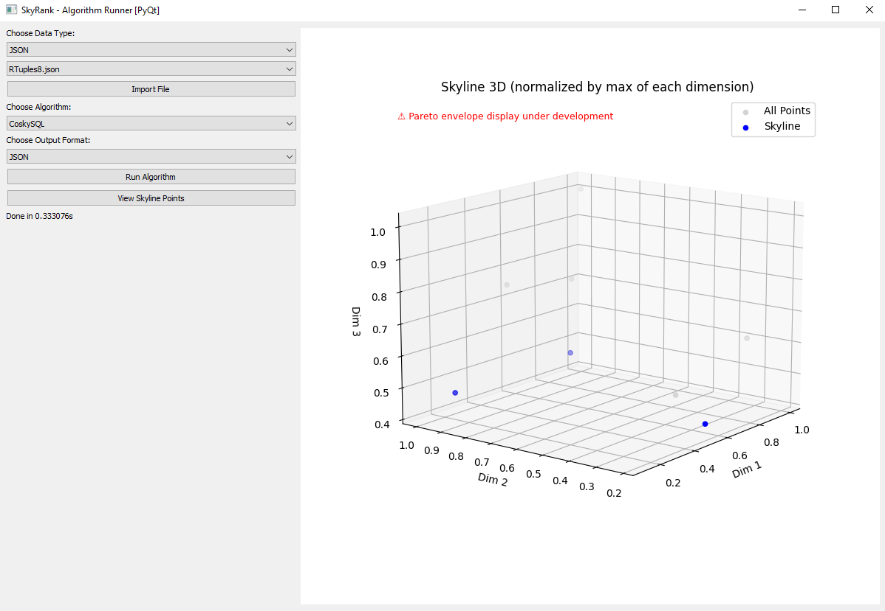
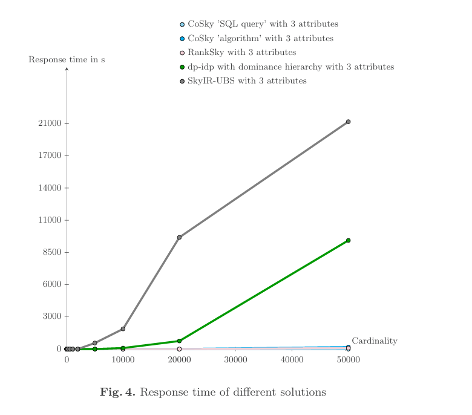

# Summary

SkyRank is an open source Python framework designed to implement, compare and visualize various **Skyline [@Borzsony2001] ranking algorithms implementations**, including `dp-idp` [@Valkanas2014] improved with dominance hierarchy, `RankSky`, `CoSky` and `DeepSky` [@MartinNevot2024]. While these methods have been independently introduced in the literature, SkyRank provides a **unified, reproducible, and extensible platform** to evaluate and visualize them interactively.

SkyRank is designed for researchers, students, and practitioners working on **multi-criteria decision making**, **Pareto dominance**, and **database preference queries**. It includes a modular benchmarking backend, a LaTeX-compatible graph generator, and two graphical user interfaces (based on PyQt5 and Tkinter) for interactive data exploration.

# Statement of need

While the Skyline operator is widely studied, **few open source tools** exist to explore, rank, and visualize Skyline points across various datasets and ranking models. Implementations are often scattered, hard to reproduce, and lack integrated visual support.

SkyRank addresses this gap by:

- Providing **ready-to-use implementations** of major Skyline ranking approaches.
- Offering **graphical interfaces** to run algorithms and compare results visually.

- Supporting **LaTeX-based chart generation** for scientific reporting.

- Enabling **fast experimentation** and educational use.

# Features

- ✅ Implementations of `dp-idp` improved with dominance hierarchy, `RankSky`, `CoSky`, `DeepSky`
- ✅ Automatic scoring using with dominance hierarchy, PageRank [@Page1998] and [@Langville2006], cosine similarity, and TOPSIS scoring [@Lai1994]
- ✅ Modular architecture for adding new ranking methods
- ✅ GUI interfaces for ranking and visual inspection of results
- ✅ Graph export in LaTeX/TikZ format
- ✅ Installation via script or editable pip package
- ✅ Benchmarking on synthetic uncorrelated datasets with 3, 6, and 9 dimensions, ranging from 10 to 1,000,000,000 tuples

# Software architecture

SkyRank relies on several Git repositories that are integrated as submodules to promote modularity and reuse:

- [`SkyRank-Client`](https://github.com/Turlure-Nael-23018992/SkyRank-Client) serves as the main interface and execution environment for SkyRank, allowing it to be used as a Python API.
- [`BBS-Python-3.x-`](https://github.com/Turlure-Nael-23018992/BBS-Python-3.x-) provides an implementation of the BBS (Branch and Bound Skyline) algorithm.
- [`R-Tree-Python-3.x-`](https://github.com/Turlure-Nael-23018992/R-Tree-Python-3.x-) implements spatial indexing structures required by BBS.

These repositories are hierarchically embedded as follows:
`SkyRank-Client` → `SkyRank` → `BBS-Python-3.x-` → `R-Tree-Python-3.x-`.

This structure enables clean separation of features, encourages reusability, and simplifies algorithmic extensions across the Skyline ecosystem.

The repository is organized into logically separated modules, with each directory serving a dedicated purpose—from algorithmic implementation to UI, benchmarking tools, and export features—ensuring modularity and clarity throughout the codebase.

- `Algorithms/` contains the core implementations of Skyline ranking methods, including `dp-idp` improved with dominance hierarchy, `RankSky`, `CoSky`, and `DeepSky`.

- `Core/` hosts the application logic and UI entry points:
  - `App.py` handles global orchestration and job launching.
  - `AppUI.py` and `AppUIPyQT.py` provide Tkinter and PyQt5 graphical interfaces.
  - `LatexMain.py` generates ready-to-use LaTeX/TikZ charts.

- `Utils/` gathers reusable tools and utilities, organized by functionality:
  - `DataModifier/` and `DataTypes/` handle data preparation, data loading and internal structures.
  - `Exporter/` defines data export interfaces (e.g., CSV, LaTeX).
  - `Latex/` includes tools for LaTeX/TikZ generation.

- `Database/` provides database integration and mock data generation:
  - The `Database` class manages SQLite creation and insertion of random test data (with dynamic column scaling).
  - `SqlDataMocker` retrieves controlled subsets of rows/columns for benchmarking and converts them using a `DataParser`.

- `Assets/` contains benchmark datasets, test databases, execution logs, and configuration files.

- `docs/` includes documentation built with `pdoc`.

- `paper/` contains the JOSS submission material (`paper.md`, `paper.bib`).

- `external/` hosts Git submodules for third-party algorithms ([BBS](https://github.com/Turlure-Nael-23018992/BBS-Python-3.x-), [RTree](https://github.com/Turlure-Nael-23018992/R-Tree-Python-3.x-)).

# Acknowledgements

The CoSky method and the overall Skyline ranking approach are based on work by M. Martin Nevot et al. [@MartinNevot2024].  
SkyRank implements and adapts these methods in a unified open-source environment.

# References
